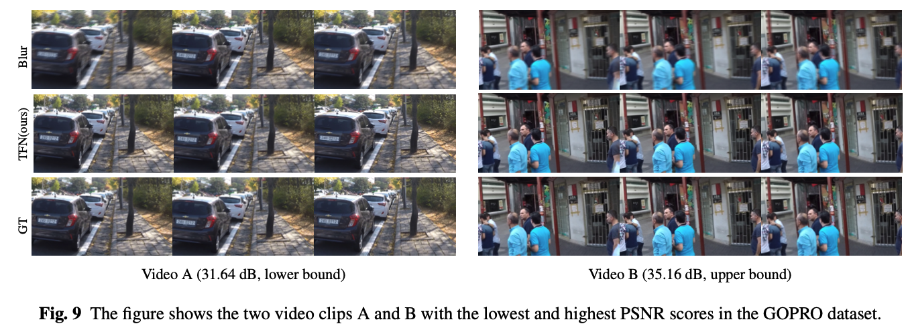

<html>

<head>
<meta http-equiv=Content-Type content="text/html; charset=utf-8">
<meta name=Generator content="Microsoft Word 15 (filtered)">

</head>

<body lang=ZH-CN link="#0563C1" vlink="#954F72" style='word-wrap:break-word;
text-justify-trim:punctuation'>

&nbsp;

&nbsp;

<b>Memory
based Temporal Fusion Network for Video Deblurring</b>

<a href="https://github.com/fengzhuziA">Chaohua Wang</a>1       <a href="https://see.xidian.edu.cn/faculty/wsdong/">Weisheng Dong</a>1*  

Xin Li2      Fangfang Wu1   <a href="https://web.xidian.edu.cn/wjj/">Jinjian Wu</a>1       <a href="https://web.xidian.edu.cn/gmshi/">Guangming Shi</a>1

1School of Artificial
Intelligence, Xidian University                   2West Virginia
University

&nbsp;

Figure
1. Architecture of the proposed network TFNet for video deblurring. 

(a) The
architecture of the proposed network. (b) The architecture of the encoder. (c) The
architecture of the temporal fusion module. (d) The detailed architecture of
our local spatial-temporal memory based temporal fusion module.

<b>Abstract</b>

Video
deblurring is one of the most challenging vision tasks because of the complex
spatial-temporal relationship and a number of uncertainty factors involved in
video acquisition. As different moving objects in the video exhibit different
motion trajectories, it is difficult to accurately capture their
spatial-temporal relationships. In this paper, we proposed a memory-based
temporal fusion network (TFN) to capture local spatial-temporal relationships
across the input sequence for video deblurring. Our temporal fusion network
consists of a memory network and a temporal fusion block. The memory network
stores the extracted spatial-temporal relationships and guides the temporal
fusion blocks to extract local spatial-temporal relationships more accurately.
In addition, to enable our model to more effectively fuse the multi-scale
features of the previous frame, we propose a multi-scale and multihop
reconstruction memory network (RMN) based on the attention mechanism and memory
network. We constructed a feature extractor that integrates residual dense
blocks with three downsample layers to extract hierarchical spatial features.
Finally, we feed these aggregated local features into a reconstruction module
to restore sharp video frames. Experimental results on public datasets show
that our temporal fusion network has achieved a significant performance
improvement in terms of PSNR metrics (over $1 dB$) over existing
state-of-the-art video deblurring methods.

&nbsp;

<a name="OLE_LINK1"><b>Paper</b></a>

<table cellpadding=0 cellspacing=0>
 <tr>
  <td width=415 height=0></td>
 </tr>
 <tr>
  <td></td>
  <td></td>
 </tr>
</table>

 
<b>                         
              </b><a
href="https://doi.org/10.1007/s11263-023-01793-y">IJCV  2023 </a>                               

&nbsp;

<b><i>Citation</i></b>

C. Wang,
W. Dong, X. Li, F. Wu, J. Wu and G. Shi, &quot; Memory
based Temporal Fusion Network for Video Deblurring,&quot; in International

Journal
of Computer Vision (IJCV), doi: 10.1007/s11263-023-01793-y.

&nbsp;

<b><i>Bibtex</i></b>

@article{wang2023memory,

  title={Memory
Based Temporal Fusion Network for Video Deblurring},

 
author={Wang, Chaohua and Dong, Weisheng and Li, Xin and Wu, Fangfang and Wu,
Jinjian and Shi, Guangming},

 
journal={International Journal of Computer Vision},

 
pages={1--17},

 
year={2023},

 
publisher={Springer}

}

&nbsp;

&nbsp;

&nbsp;

&nbsp;

&nbsp;

<b>Download</b>

&nbsp;

&nbsp;

<table cellpadding=0 cellspacing=0>
 <tr>
  <td width=432 height=0></td>
 </tr>
 <tr>
  <td></td>
  <td></td>
 </tr>
</table>

 
                                                                <a href="https://github.com/fengzhuziA/TFmodel">Code</a>      
                                

&nbsp;

&nbsp;

  

<b>Results:</b><b><i> Comparison with
State-of-the-art Reconstruction Methods:</i></b>

Table 1 and
Table 2 . The quantitative results on GOPRO and BSD dataset.

<b></b>

&nbsp;

&nbsp;

Figure
2. Visualizations of attention maps. (a) The input blurred frames. (b)
Deblurred frames by the proposed method. (c) The ground truth frames. (d)
Attention maps of the middle frame in adjacent frames.

Figure
3. The figure shows the two video clips A and B with the lowest and highest
PSNR scores in the GOPRO dataset.

&nbsp;

&nbsp;

&nbsp;

&nbsp;

<b>References</b>

[1] Wang X, Chan KCK, Yu K, Dong C,
Loy CC (2019) EDVR: video restoration with enhanced deformable convolutional
networks. In:IEEE Conference on ComputerVision and Pattern Recognition
Workshops, CVPR Workshops 2019, Long Beach, CA, USA, June 16-20, 2019,Computer
Vision Foundation / IEEE, pp 1954–196

[2]
Zhou S, Zhang J, Pan J, Zuo W, Xie H, Ren JSJ (2019) Spatio-temporal filter
adaptive network for video deblurring. In: 2019 IEEE/CVF International
Conference on Computer Vision, ICCV 2019, Seoul, Korea (South), October 27 -
November 2, 2019, IEEE, pp 2482–2491

[3]
Zhong Z, Gao Y, Zheng Y, Zheng B (2020) Efficient spatio-temporal recurrent
neural network for video deblurring. In: Vedaldi A, Bischof H, Brox T, Frahm J
(eds) Computer Vision - ECCV 2020 - 16th European Conference, Glasgow, UK,
August 23-28, 2020, Proceedings, Part VI, Springer, Lecture Notes in Computer
Science, vol 12351,pp 191–207

[4]
Zhang H, Dai Y, Li H, Koniusz P (2019) Deep stacked hierarchical multi-patch
network for image deblurring. In:IEEE Conference on Computer Vision and Pattern
Recognition, CVPR 2019, Long Beach, CA, USA, June 16-20, 2019, Computer Vision
Foundation / IEEE, pp 5978–5986

[5]
Tsai F, Peng Y, Lin Y, Tsai C, Lin C (2021) Banet: Bluraware attention networks
for dynamic scene deblurring. CoRR abs/2101.07518

[6]
Zamir SW, Arora A, Khan SH, Hayat M, Khan FS, Yang M, Shao L (2021) Multi-stage
progressive image restoration. In: IEEE Conference on Computer Vision and Pattern
Recognition, CVPR 2021, virtual, June 19-25, 2021,Computer Vision Foundation /
IEEE, pp 14821–14831

[7]
Chen L, Lu X, Zhang J, Chu X, Chen C (2021) Hinet: Halfinstance normalization
network for image restoration. In:IEEE Conference on Computer Vision and
Pattern Recognition Workshops, CVPR Workshops 2021, virtual, June19-25, 2021,
Computer Vision Foundation / IEEE, pp 182–192

[8]
Zhu C, Dong H, Pan J, Liang B, Huang Y, Fu L, Wang F (2021) Deep recurrent
neural network with multi-scale bi-directional propagation for video
deblurring. CoRR abs/2112.05150

[9]
Kim TH, Lee KM, Sch¨ olkopf B, Hirsch M (2017) Online video deblurring via
dynamic temporal blending network.In: IEEE International Conference on Computer
Vision,ICCV 2017, Venice, Italy, October 22-29, 2017, IEEE Computer Society, pp
4058–4067

[10]
Su S, Delbracio M, Wang J, Sapiro G, Heidrich W, Wang O (2017) Deep video
deblurring for hand-held cameras. In:2017 IEEE Conference on Computer Vision
and Pattern Recognition, CVPR 2017, Honolulu, HI, USA, July 21-26, 2017, IEEE Computer
Society, pp 237–246

[11]
Nah S, Son S, Lee KM (2019) Recurrent neural networks with intra-frame
iterations for video deblurring. In: IEEEConference on Computer Vision and
Pattern Recognition, CVPR 2019, Long Beach, CA, USA, June 16-20, 2019,Computer
Vision Foundation / IEEE, pp 8102–8111

&nbsp;

&nbsp;

<b>Contact</b>

Chaohua
Wang, Email: <a href="mailto:3267928656@qq.com">3267928656@qq.com</a>

Weisheng
Dong, Email: wsdong@mail.xidian.edu.cn

Xin Li,
Email: <a href="mailto:xin.li@ieee.org">xin.li@ieee.org</a>

FangFang
Wu, Email: ffwu
<a href="mailto:xd@163.com">xd@163.com</a>

Jinjian
Wu,Email: jinjian.wu@mail.xidian.edu.cn

Guangming
Shi, Email: gmshi@xidian.edu.cn

&nbsp;

&nbsp;

&nbsp;

&nbsp;

&nbsp;

&nbsp;

&nbsp;

</body>

</html>
